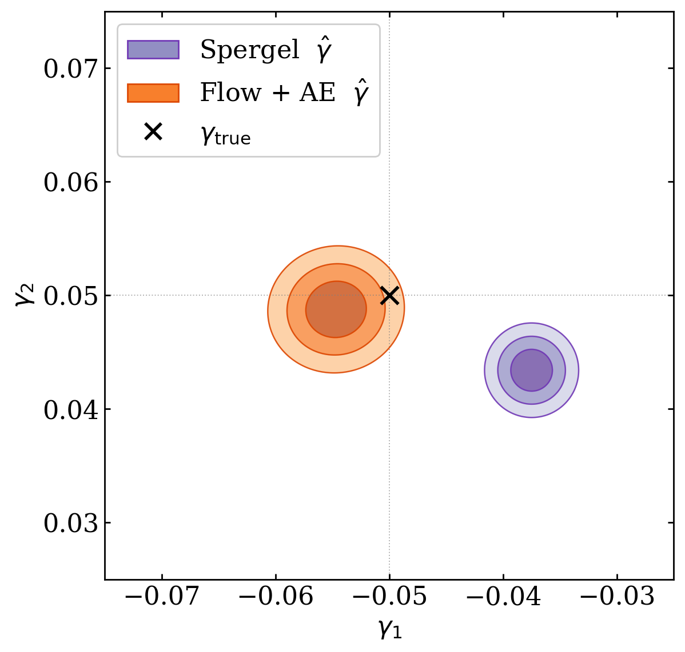

<div align="center">

# Shear Inference Environment

**Generative forward modelling for radio weak gravitational lensing**

[](https://www.python.org/)
[](https://github.com/jax-ml/jax)
[](LICENSE)
[](#publication--citation)

[**Overview**](#overview) · [**Results**](#main-results) · [**Install**](#installation) · [**Usage**](#usage) · [**Pipeline**](#pipeline-structure) · [**Cite**](#publication--citation)

</div>

---

Differentiable generative forward model and Bayesian shear inference pipeline for **radio weak lensing**. Built on JAX, [`jax-galsim`](https://github.com/GalSim-developers/JAX-GalSim), [`numpyro`](https://github.com/pyro-ppl/numpyro), and [`blackjax`](https://github.com/blackjax-devs/blackjax) (MCLMC sampler), with a normalising-flow-reparameterised autoencoder prior trained on COSMOS HST stamps.

### Highlights

- **Differentiable forward model** — Fourier-space radio image rendering through `jax-galsim`, with end-to-end gradients of the likelihood w.r.t. shear and per-galaxy parameters.
- **Two galaxy morphologies** — parametric (Spergel / Exponential / composite) or an **AE + normalising flow** galaxy generative model trained on COSMOS real galaxies.
- **Gradient-based MCMC** — MCLMC (`blackjax`) with diagonal mass-matrix preconditioning, gradient-aware step-size initialisation, and automatic adaptation retries.
- **Realistic radio-adapted observations** — UV coverage from SKA-Mid array simulated with the [`argosim`](https://github.com/ARGOS-telescope/argosim) package.


## Overview

The pipeline simulates radio interferometric observations of galaxies, samples the joint posterior over cosmic shear $(\gamma_1, \gamma_2)$ and per-galaxy nuisance parameters via gradient-based MCMC, and produces per-run GMM/Gaussian posterior summaries that can be combined across runs.

Two forward models are supported:

1. **Parametric** — Spergel / Exponential / composite (bulge + disk) profiles with per-galaxy $(e_1, e_2, \text{hlr}, \text{flux}, \nu)$ priors. No machine learning involved.
2. **AE + Flow generative** — galaxies are represented by latent codes $u \sim \mathcal{N}(0, I)$, transformed through an **unconditional normalising flow** to a learned VAE latent $z$, then decoded by a pretrained **galaxy autoencoder**. Trained on COSMOS stamps so the prior matches the morphological distribution of real galaxies.

The AE encoder/decoder and the latent-space normalising flow live in the companion repository [**pshear** (`probabilistic-shear`)](https://github.com/b-remy/probabilistic-shear) — clone and install that one first.


## Main results

Shear posterior on 10 000 AE-whitened COSMOS galaxies observed with SKA-Mid (8 h track, 1.4 GHz, $\sigma_{uv} = 0.01$):




| Forward model          | Centre vs truth                                |
| :--------------------- | :--------------------------------------------- |
| Spergel (parametric)   | ~10 $\sigma$ biased on $(\gamma_1, \gamma_2)$  |
| Flow + AE (generative) | within 2 $\sigma$                              |

- **Spergel** (purple): 68 / 95 / 99.7 % credible regions of the shear posterior, using the parametric forward model. Recovers a tight but **biased** posterior — the parametric prior is too restrictive to capture COSMOS morphologies, so the inferred shear is model biased.
- **Flow + AE** (orange): 68 / 95 / 99.7 % credible regions, using the generative forward model. Recovers a **correctly centred** posterior with slightly larger uncertainty than the Spergel case, but without the bias.

The AE+flow result is reproduced by `outputs/papers/notebooks/cosmos_shear_estimates_plot.ipynb` from the precomputed `combined_gmm_results.npz` summaries in each subdirectory.


## Installation

```bash
# 1. Create a Python 3.10+ environment
conda create -n forwardmodel python=3.10
conda activate forwardmodel

# 2. Install the runtime dependencies
pip install jax numpyro blackjax jax-galsim equinox argosim optax corner flowjax

# 3. Install the companion pshear package (autoencoder + flow)
git clone https://github.com/b-remy/probabilistic-shear
cd probabilistic-shear && pip install -e . && cd ..

# 4. Clone this repository
git clone https://github.com/CentofantiEze/Radio_WL_Generative_Forward_Model    
cd Radio_WL_Generative_Forward_Model
```

## Usage

The main entry point is [`scripts/run.py`](scripts/run.py). All variants of the pipeline are configured via command-line arguments (parsed by [`src/shearest/cli.py`](src/shearest/cli.py)`::parse_args`, which also performs cross-argument validation). Convenience shell scripts wrap common configurations; ready-to-run launchers for the paper configurations live under `outputs/papers/jobs/`.

```bash
# Example: AE + Flow generative model cosmos HST galaxies. 
cd papers/jobs/real_hst_galaxies
bash hst_ae_flow_model.sh
```


## Pipeline structure

`scripts/run.py` ingests an antenna configuration, simulates a radio observation of a synthetic (or real-COSMOS-derived) galaxy field, and samples the joint posterior over cosmic shear $(\gamma_1, \gamma_2)$ and per-galaxy nuisance parameters. The end-to-end flow is:

| # | Stage | What it does | Module |
| :-: | :--- | :--- | :--- |
| 1 | **CLI & logging** | Parse and validate CLI args, create the output directory, configure the package logger (stdout + timestamped file handler). | `cli.py`, `logging_setup.py` |
| 2 | **PSF generation** | Antenna config (SKA-Mid file or random) → UV coverage mask → dirty PSF. | `psf_utils.py` |
| 3 | **Data generation** | Draw galaxies (Spergel, raw HST cutouts, or AE-whitened COSMOS), render in Fourier space, sample at `uv_pos`, add Gaussian noise. | `data_gen_utils.py` |
| 4 | **Forward-model build** | Load the model AE and (optional) latent normalising flow, build the numpyro forward model, wrap a JIT-compiled, gradient-checkpointed log-density for MCMC. | `model_utils.py` |
| 5 | **MAP estimation** | Adam or Adafactor on the joint negative log-posterior with multi-transform LR (`lr_map` for nuisance parameters, $\times$ `lr_map_shear_factor` for $\gamma$). Result cached as `radio_map_val.npy` and reused when `--precomputed_map` is set. | `run.py` |
| 6 | **MCLMC adaptation** | Gradient-aware initial step size and trajectory length $L$, diagonal mass-matrix preconditioning, automatic retry on collapse. | `sampling.py` |
| 7 | **Sampling** | MCLMC kernel from `blackjax`, vmapped over chains and scanned over steps, in two outer iterations of `num_chains × num_steps`. | `run.py` |
| 8 | **Posterior summary** | Fit a 5-component GMM in $(\gamma_1, \gamma_2)$, save GMM parameters and sample-level mean / standard deviation. | `posterior_utils.py` |
| 9 | **Plotting** *(optional)* | UV mask / PSF, data grid, MAP convergence, chain traces, corner plot, GMM overlay. Gated by `--save_plots`. | `plotting.py` |

> **Precision.** MAP estimation and MCLMC adaptation run in `float32` for numerical stability; the VAE decoder is rebuilt in `float16` for the sampling loop (~2× speedup on V100). See `cast_ae_to_float16` in `model_utils.py`.
>
> **Wall-clock.** ~50 min on a V100 GPU for 100 galaxies with the AE+flow model (`n_warmup=5000, num_chains=4, num_steps=500, num=5`), reaching ESS ≈ 200 on the shear parameters. The parametric Spergel model is much faster (~10 min) since the generative model is simpler.


## Repository layout

<details>
<summary><b>Click to expand</b></summary>

```
src/shearest/          # core library
    cli.py             # parse and validate CLI args
    logging_setup.py   # setup_logger (stdout + timestamped file handler)
    model_utils.py     # numpyro forward models
    data_gen_utils.py  # galaxy generative models
    psf_utils.py       # compute radio PSF via argosim
    sampling.py        # MCLMC setup and adaptation
    plotting.py        # plotting utilities
    func_utils.py      # helper functions
    posterior_utils.py # GMM fitting and combination

scripts/
    run.py             # main entry point

notebooks/             # diagnostic / exploration notebooks

outputs/
    papers/figs/       # paper-ready figures
    papers/jobs/       # bash scripts for paper runs
    papers/notebooks/  # notebooks for paper figures

data/
    SKA-Mid.txt        # SKA-Mid antenna positions
    trecs_gal_params.npy
```

</details>

---

## Publication & citation

A paper presenting this generative forward model and its application to COSMOS galaxies adapted to radio observations with SKA-Mid is in preparation. The preprint link, citation, and BibTeX entry will be added here once available.

```bibtex
@misc{Centofanti2026shear,
  author       = {Centofanti Ezequiel, Remy Benjamin, Ayçoberry Emma, Lanusse François, Starck Jean-Luc, and Farrens Samuel},
  title        = {SHINE: Shear inference environment - Generative forward modelling for radio weak gravitational lensing},
  year         = {2026},
}
```

## License

Released under the [MIT License](LICENSE).

---

<p align="center">
  <sub>Repository under active development.</sub>
</p>
